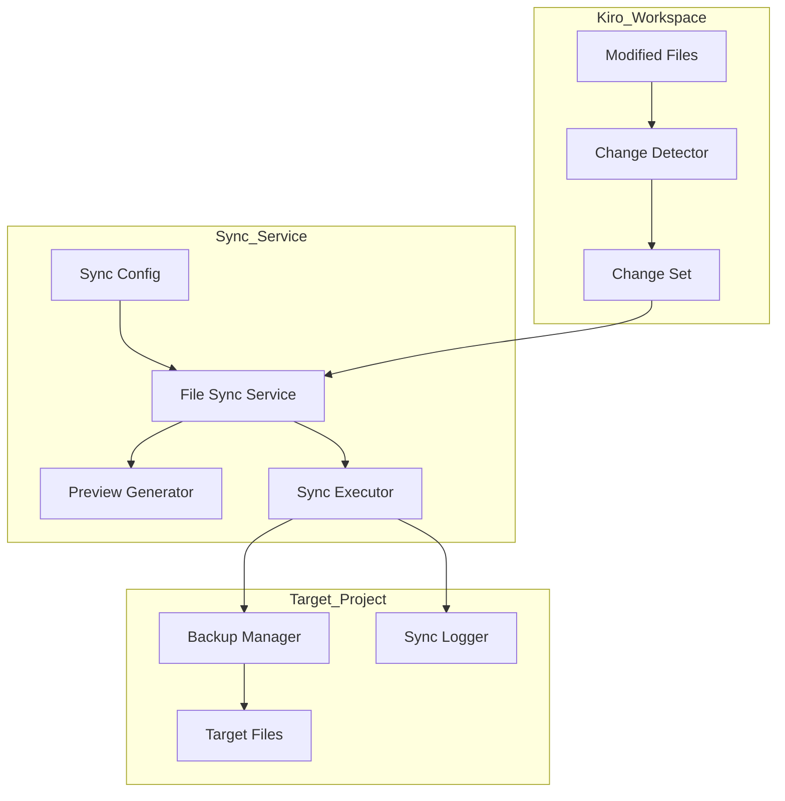

# Design Document: File Sync to Project

## Overview

本设计实现一个文件同步服务，将 Kiro 工作空间中的文件变更安全地同步到用户指定的目标项目目录。该服务采用 Shell 脚本实现，通过配置文件管理同步目标，支持变更检测、预览和批量同步。

## Architecture



## Components and Interfaces

### 1. Sync Config Manager

负责管理同步配置，存储在 `.kiro/sync-config.json`。

```json
{
  "targetPath": "/Volumes/mac_data/code/go_code/service_test",
  "excludePatterns": [
    "node_modules/**",
    ".git/**",
    "*.log"
  ],
  "backupEnabled": true,
  "backupDir": ".kiro/backups"
}
```

### 2. Change Detector

检测工作空间中的文件变更，生成变更集合。

```bash
# 接口：检测变更
detect_changes() -> ChangeSet

# 变更类型
# - ADD: 新增文件
# - MODIFY: 修改文件  
# - DELETE: 删除文件
```

### 3. File Sync Service

核心同步服务，协调各组件完成同步操作。

```bash
# 接口定义
sync_init()           # 初始化同步配置
sync_preview()        # 预览待同步变更
sync_execute()        # 执行同步
sync_status()         # 查看同步状态
```

### 4. Backup Manager

在同步前备份目标文件。

```bash
# 备份目录结构
.kiro/backups/
  └── 2026-01-01_120000/
      ├── manifest.json
      └── files/
          └── [backed up files]
```

### 5. Sync Logger

记录所有同步操作用于审计。

```bash
# 日志格式
.kiro/sync-logs/
  └── sync_2026-01-01.log
```

## Data Models

### SyncConfig

```typescript
interface SyncConfig {
  targetPath: string;           // 目标项目路径
  excludePatterns: string[];    // 排除的文件模式
  backupEnabled: boolean;       // 是否启用备份
  backupDir: string;            // 备份目录
}
```

### ChangeEntry

```typescript
interface ChangeEntry {
  path: string;                 // 相对文件路径
  type: 'ADD' | 'MODIFY' | 'DELETE';
  sourcePath: string;           // 源文件完整路径
  targetPath: string;           // 目标文件完整路径
  timestamp: string;            // 变更时间
}
```

### SyncResult

```typescript
interface SyncResult {
  success: boolean;
  syncedFiles: string[];
  failedFiles: Array<{path: string; error: string}>;
  backupPath?: string;
  timestamp: string;
}
```

## Correctness Properties

*A property is a characteristic or behavior that should hold true across all valid executions of a system-essentially, a formal statement about what the system should do. Properties serve as the bridge between human-readable specifications and machine-verifiable correctness guarantees.*

### Property 1: Config Round Trip

*For any* valid SyncConfig object, writing it to `sync-config.json` then reading it back SHALL produce an equivalent object.

**Validates: Requirements 1.1**

### Property 2: Path Validation Correctness

*For any* file path, the validation function SHALL return true if and only if the path exists and is writable.

**Validates: Requirements 1.2**

### Property 3: Change Detection Completeness

*For any* file operation (create, modify, delete) in the workspace, the Change Detector SHALL add a corresponding entry to the Change Set with the correct type.

**Validates: Requirements 2.1, 2.2, 2.3**

### Property 4: Gitignore Pattern Matching

*For any* file path and gitignore pattern set, files matching any pattern SHALL be excluded from the Change Set.

**Validates: Requirements 2.4**

### Property 5: Sync Preserves Content

*For any* file in the Change Set, after sync execution, the target file content SHALL be identical to the source file content.

**Validates: Requirements 3.1**

### Property 6: Directory Creation

*For any* file sync where parent directories don't exist in target, the sync SHALL create all necessary parent directories.

**Validates: Requirements 3.3**

### Property 7: Successful Sync Clears Change Set

*For any* successful sync operation, the Change Set SHALL be empty after completion.

**Validates: Requirements 3.4**

### Property 8: Backup Before Overwrite

*For any* file that exists in Target_Project and will be overwritten, a backup SHALL be created before the sync.

**Validates: Requirements 4.3**

### Property 9: Sync Logging

*For any* sync operation, a log entry SHALL be created containing timestamp, files synced, and result status.

**Validates: Requirements 4.4**

### Property 10: Preview Completeness

*For any* Change Set, the preview output SHALL contain all entries with their paths, types, and change summaries.

**Validates: Requirements 5.1, 5.2**

### Property 11: Selective Exclusion

*For any* file marked as excluded by the user, that file SHALL NOT be included in the sync operation.

**Validates: Requirements 5.3**

## Error Handling

| Error Scenario | Handling Strategy |
|----------------|-------------------|
| Target path not found | Return error, abort sync |
| Target path not writable | Return error, abort sync |
| File copy fails | Log error, continue with other files, report at end |
| Backup creation fails | Abort sync for that file, report error |
| Disk space insufficient | Abort sync, report error |

## Testing Strategy

### Unit Tests
- Config file read/write operations
- Path validation logic
- Gitignore pattern matching
- Change type detection

### Property-Based Tests
- Config round trip (Property 1)
- Path validation (Property 2)
- Change detection (Property 3)
- Pattern matching (Property 4)
- Content preservation (Property 5)
- Backup creation (Property 8)

### Integration Tests
- End-to-end sync workflow
- Backup and restore workflow
- Error recovery scenarios
